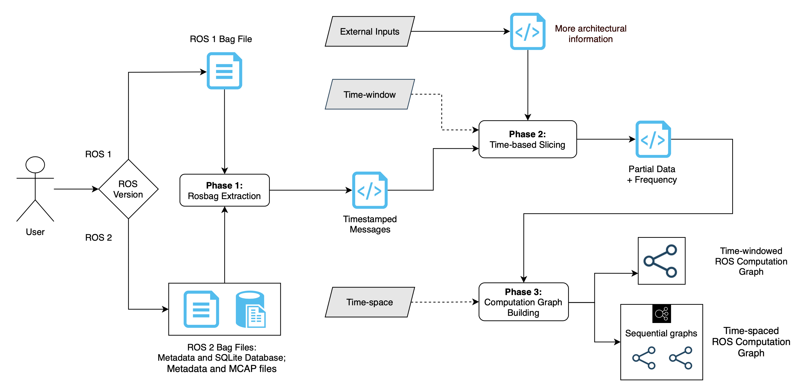
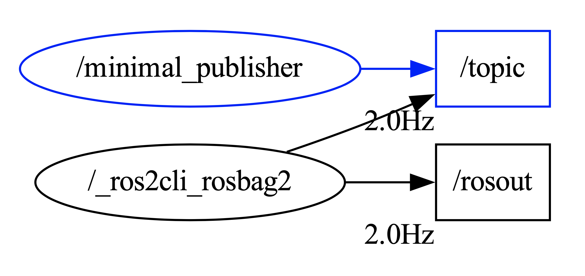

# RosART - ROS Static Architecture Extraction and Visualization Tool
This project results in a comprehensive and complete tool for extracting, analyzing, and visualizing ROS architectural information, with special attention to debugging tasks.

## The Approach
The following figure illustrates the 3-phases approach to extract computation graphs from the ROS bag files: 

* ***Rosbag Extraction***: In this phase, the time-stamped data from the bagfile is extracted, encompassing records of nodes and topics’ activities. Subsequently, this data is organized into separate CSV files for each topic, ensuring ease of access for further analysis. Supported file formats include ``bag``(ROS1), ``db3``(ROS2) and ``mcap``(ROS2).
* ***Time-window Slicing***: In this phase, we extract the data based on the time-window specified by the user and the CSV files from phase 1. Within this defined timeframe, the tool computes how often data is published on a certain topic, also term as frequency. Moreover, the external input file is also read and processed, resulting in two CSV files, namely ‘pubs.csv’ and ‘subs.csv’.
* ***Computation Graph Building***: In this phase, a series of computation graphs are created based on the user-defined time interval and information obtained from prior phases. Without the user-defined time interval, a single computation graph is returned and covers the information within the user-defined time window. This graph is constructed utilizing [Graphviz](https://www.graphviz.org) to reproduce a consistent view with [RQT](https://wiki.ros.org/rqt_graph), which is a standard among the ROS community. In addition to the computation graph, each graph is accompanied by a corresponding metric, containing all data from bagfile based on the specified time range.

<p align="center"></center></p>


## Repository Organization

```
./bagfiles/          - Contains samples of bag files and a list of all we found on GitHub.
./graphs/            - Contains the extracted computation graphs.
./metrics/           - Contains the metrics of each bag file after extraction.
./node_input/        - Contains the external inputs with architectural information.
./src/git_api/       - Contains the code used and documentation to crawl GitHub repositories.
./src/extractor/     - Contains the source code and documentation of the architecture extractor.
```

## Installation
Note that it is not necessary for our architecture extractor, which is independent of platforms. However, it requires a few dependencies, solved by the following commands:

```
$ pip3 install -r ./requirements.txt
$ sudo apt install graphviz
```
* If the requirements list is/becomes broken, do not hesitate to pull request the necessary updates.

Then, just run the extraction script on a bag file: 
```
$ python3 extractor.py [-h] <-v ROS_VERSION> [-s START_TIME] [-e END_TIME] <-f FILE_PATH> <-ft FILE_TYPE> [-i INPUT] [-ts TIME_SPACE]
```

##### Example

Here, we provide an example with a very simple ROS 2 bag file:
```
$ python3 extractor.py -v=ros2 -s=1 -e=3 -f=./bagfiles/ros2/talker -ft=db3 -i=./node_input/minimal_publisher.csv
```
By running this command, the tool extracts from the 1st second to the 3rd second of the bagfile, with information from the external input.

The expected result is the following image, which can be found in the ``graphs/ros2`` directory:



The corresponding metric as follows can be found in the ``metrics`` directory.
```json
{
    "Filepath": "./bagfiles/ros2/talker",
    "Start": 1585866236.1124113,
    "End": 1585866238.1124113,
    "Topics": {
        "/topic": {
            "name": "/topic",
            "source": "external",
            "frequency": null
        },
        "/rosout": {
            "name": "/rosout",
            "start": 1585866235.612677,
            "end": 1585866239.612762,
            "frequency": 2.0
        }
    },
    "Nodes": {
        "/_ros2cli_rosbag2": {
            "name": "/_ros2cli_rosbag2",
            "source": "fixed node",
            "#publisher": 0,
            "#subscriber": 2,
            "avg_pub_freq": 2.0
        },
        "/minimal_publisher": {
            "name": "/minimal_publisher",
            "source": "external",
            "#publisher": 0,
            "#subscriber": 1,
            "avg_pub_freq": 0
        }
    }
}
```


