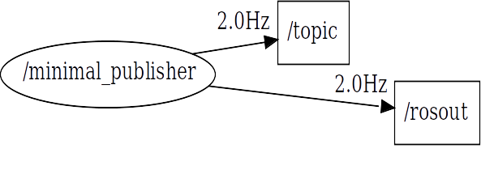

# Automatic Extraction of ROS Computation Graphs from ROS Bag Files

This project is an extension of the tool presented at the Robot Software Architecture Workshop ([RSA 2023](https://roboticsa.github.io/RoboticSA2023/)) co-located with the International Conference on Robotics and Automation [ICRA 2023](https://www.icra2023.org). The original project can be found [here](https://github.com/S2-group/icra-ws-robotics-rosbag).


This study has been designed, developed, and reported by the following investigators:

- [Michel Albonico](https://michelalbonico.github.io/) (Federal University of Technology, Paraná - UTFPR)
- [Berry Chen](#) (Student@Vrije Universiteit Amsterdam)
- [Ivano Malavolta](https://www.ivanomalavolta.com) (Vrije Universiteit Amsterdam)

This project is about a tool to statically extract time-windowed computation graphs from [ROS bag files](http://wiki.ros.org/rosbag). Our approach is an alternative to dynamic extractors, such as the [rqt_graph](http://wiki.ros.org/rqt_graph) tool.

## Repository Organization

```
./bagfiles/          - Contains samples of bag files and a list of all we found on GitHub.
./src/git_api/       - Contains the code used and documentation to crawl GitHub repositories.
./src/extractor/     - Contains the source code and documentation of the architecture extractor.
```

## Installation
Note that it is not necessary for our architecture extractor, which is independent of platforms. However, it requires a few dependencies, solved by the following commands:

```
$ pip3 install -r ./requirements.txt
$ sudo apt install graphviz
```
If the requirements list is/becomes broken, do not hesitate to pull request the necessary updates.

Then, just run the extraction script on a bagfile: 
```
$ ./extractor.sh <ros_version> [<start_time> <end_time>] /path/file
```

##### Example

Here, we provide and example with a very simple ROS 2 bag file:
```
$ export root_dir='your project dir'
$ ./extractor.sh ros2 "2020-02-04 07:23:55" "2020-02-04 07:23:59" $root_dir/bagfiles/ros2/talker/
```

The expected result is the following image, which will be in the rosbag file directory:



# Improvements

- [ ] Add support for ROS services via the new service introspection feature provided by the Iron Irwini distribution.
- [ ] Integrate other static analyzers like [HAROS](https://github.com/git-afsantos/haros) to complement the extracted architecture with additional information. 
- [ ] If no datetime parameter is passed, generate the graph of the whole bag.
- [ ] Pass time argument in seconds instead of the precise date and time.
- [ ] Organize the generated graphs in a different folder than ros bag one.
- [ ] Command to see how long (in terms of seconds) the bag is.
- [ ] Slice the file according to a fixed interval (e.g., each 10 seconds), generating different sequential graphs.
- [ ] Grab nodes information from launch files and source code.
- [ ] Integrate with RQT Graph tool.

## In Progress

- [ ] Code polishing and general updates

## Done ✓

- [x] Compute additional metrics for each connection (e.g., publishing rate)
- [x] Add support for rosbag2 files  

<!--
## Public Bagfiles

- In [this](https://drive.google.com/drive/folders/1HwNHiVZJhChzVv4ZwMy9yN5gWYnwAsSi?usp=sharing) shared folder, you will find some bagfiles from our team experiments with ROS+SLAM.
- We have also used the [MET dataset](https://starslab.ca/enav-planetary-dataset/) for our tool validation. It contains huge bagfiles from a rover robot navigation.
- [This](#) spreadsheet contains all the public bagfiles we found on GitHub. 

## Extracting information from ROS bags
By using python and its package [bagpy](https://jmscslgroup.github.io/bagpy/), messages stored in the bagfiles can be read and decoded. Topics presented in the bagfile can be extracted by using `b.topic_table,` where `b` is a bagreader object. Then, we need first to check whether `rosout` is in the topic table or not. If not, the architecture information cannot be extracted with our approach. Otherwise, the information needed to generate a computational graph can be extracted, and [Graphviz](https://graphviz.org) is used to connect and visualize the graph.

## Validation
Comparing to the dynamic approach(rqt_graph), our static approach workds totally independent on ROS environment. Validation process are done by manually checking the graphs of each bagfiles in the validation set and compare the differences between two approaches' graphs.

-->

<!--## Result
By applying our static approach to the 242 bagfiles obtained from GitHub, it is found that most bagfiles can be extracted without any problem. Also, problems occurred within 49 bags where the main node `/rosout` is not recorded in the bag.  

Extraction result: Full list can be found [here](https://drive.google.com/file/d/16UHFbm1s-yIXtfGYNJD7NTrwlfN8zlXg/view)


-->


<!-- ## Requirements
Before running the graph extraction, you must install a basic ROS1 environment. Follow [this](http://wiki.ros.org/noetic/Installation/Ubuntu) tutorial.

In Ubuntu, after setting the apt-get souce, run the following command:

```
sudo apt-get install ...
```
 -->
