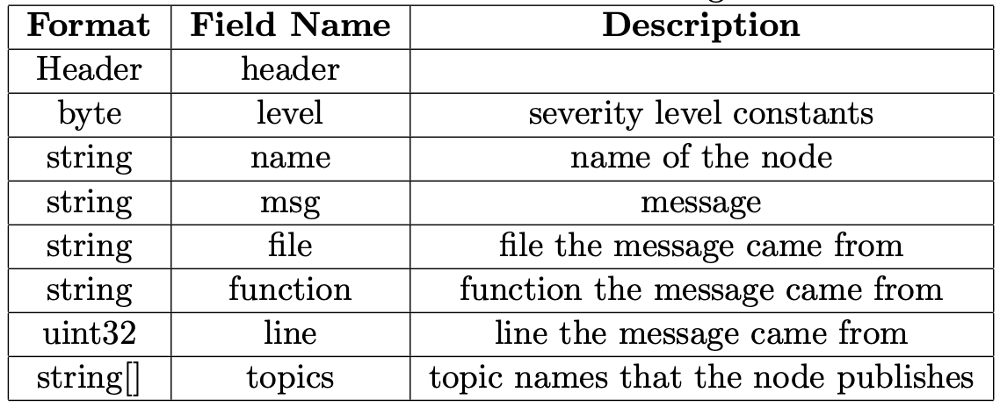
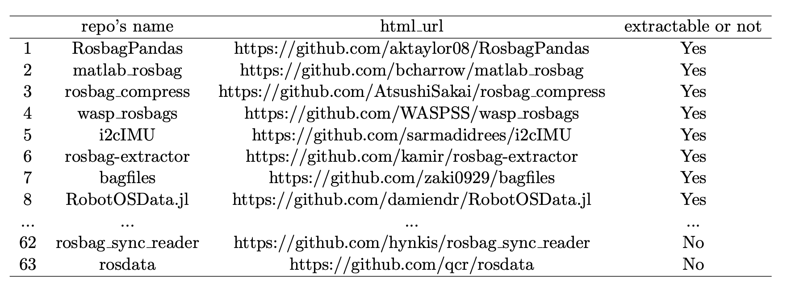

# rosbag_project

<!-- The project is based on ROS, the standard framework for implementing robotics software today. A tool-based approach is developed that, given as input a ROS bag, will automatically extract its software components (in terms of blocks, connections, and topics).  -->

In this project, we aim to design an architecture extractor with the existing information acquired from rosbags, which records the topic commands sent to the robot in a previous execution. Our approach is an alternative to dynamic extractors, such as native [rqt_graph](http://wiki.ros.org/rqt_graph) tool, which are not trivial to be executed since they require a running ROS environment. Then, our approach’s output is compared to the output of a dynamic execution with rqt graph tool over 242 bag files public available in GitHub. As a result, about 202 bagfiles’ architectures can be extracted correctly, where the extractor cannot performed properly on the rest of bagfiles due to the lack of information while recording.

The project consists of 3 phases：
1. ROS in general
2. Extracting information from ROS bags
3. Validation

To run the extraction script: 
```
python3 extract_graph /path/file
```

## ROS in general
ROS documentation: http://wiki.ros.org
ROS tutorials : http://wiki.ros.org/ROS/Tutorials

**Only ROS1 is used in this project.**

There are 3 common used instructions in this project, namely [roscore](http://wiki.ros.org/roscore), [rosbag record](http://wiki.ros.org/rosbag/Commandline), and [rqt_graph](http://wiki.ros.org/rqt_graph)

- `roscore` starts a master node in ROS environment, where default node `rosout`, topics `rosout` and `rosout_agg` are present. It is necessary to run `roscore` before taking any further actions in ROS environment. Before running `roscore`, we need to source the *setup.bash* script at the beginning on every new terminal where ROS is intended to use, then ROS master can be started. 
```
source ~/catkin_ws/devel/setup.bash
roscore
```

- `rosbag record` only records the messages that published **on** the topics, resulting in a binary format bagfile with fields such as name, msg, and topics.

Fields in a rosbag file:


- `rqt_graph`, which works based on ROS environment, provides computational graphs while executing bagfiles. If no file is running, the computational graph only consists of a the default node and topics, combining with the topic `statistics` and node `rqt_gui_py_node_id` which are triggered by command `rqt_graph`

## Extracting information from ROS bags
By using python and its package [bagpy](https://jmscslgroup.github.io/bagpy/), messages stored in the bagfiles can be read and decoded. Topics presented in the bagfile can be extracted by using `b.topic_table,` where `b` is a bagreader object. Then, we need first to check whether `rosout` is in the topic table or not. If not, the architecture information cannot be extracted with our approach. Otherwise, the information needed to generate a computational graph can be extracted, and [Graphviz](https://graphviz.org) is used to connect and visualize the graph.

## Validation
Comparing to the dynamic approach(rqt_graph), our static approach workds totally independent on ROS environment. Validation process are done by manually checking the graphs of each bagfiles in the validation set and compare the differences between two approaches' graphs.

## Result
By applying our static approach to the 242 bagfiles obtained from GitHub, it is found that most bagfiles can be extracted without any problem. Also, problems occurred within 49 bags where the main node `/rosout` is not recorded in the bag.  

Extraction result: Full list can be found [here](https://drive.google.com/file/d/16UHFbm1s-yIXtfGYNJD7NTrwlfN8zlXg/view)



<!-- ## Requirements
Before running the graph extraction, you must install a basic ROS1 environment. Follow [this](http://wiki.ros.org/noetic/Installation/Ubuntu) tutorial.

In Ubuntu, after setting the apt-get souce, run the following command:

```
sudo apt-get install ...
```
 -->
